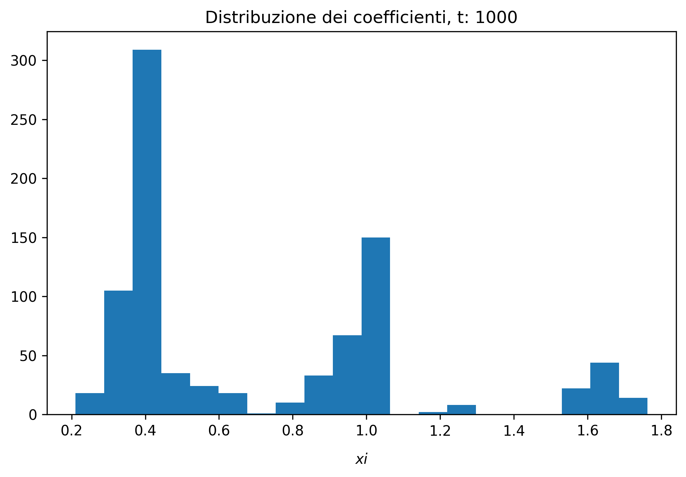
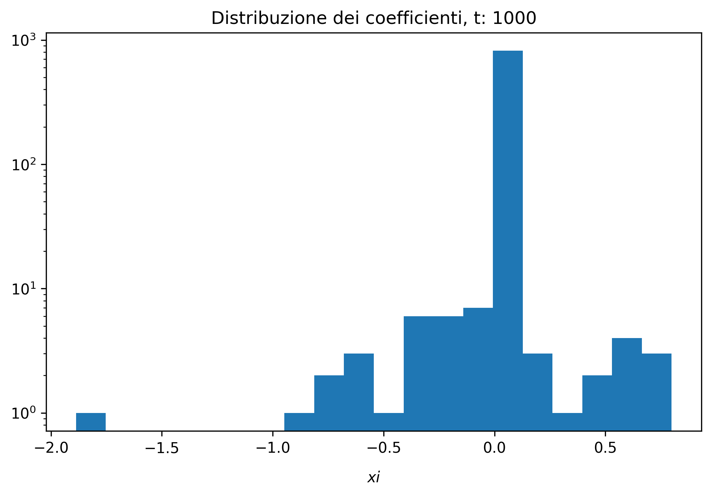
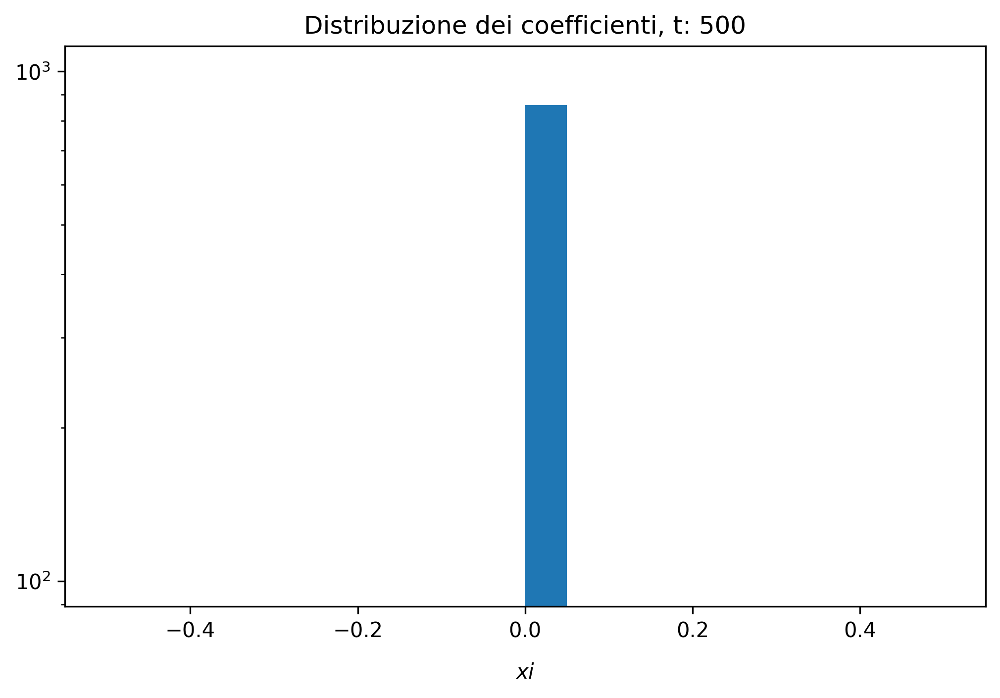

---
author:
- Pietro Sillano
bibliography:
- bibliography.bib
nocite:
- "[@pytorch]"
- "[@kchamp]"
title:  A pendulum video and autoencoder
---

# Introduzione

L'uso di reti neurali o deep learning per la previsione della dinamica
di sistemi dinamici presenta alcune criticitá, tra cui problemi di
generalizzazione al di fuori degli esempi del training set e inoltre una
mancanza di interpretabilitá del modello ottenuto, dovuta al grande
numero di parametri di tali modelli.

# Task

L'obiettivo consiste nell' individuare un set di equazioni che possa
catturare la dinamica del sistema e che sia allo stesso tempo il piú
semplice possibile. L'idea del paper considerato consiste nel combinare
un **autoencoder** che effettui una riduzione di dimensionalitá
dell'input e un metodo chiamato **SINDy**(Sparse Identification of
Nonlinear Dynamics) che riesce a individuare un modello dinamico per il
sistema nelle nuove coordinate latenti.\
Infatti, non sempre i dati che vengono raccolti rappresentano la
dinamica del sistema nella migliore o nella piú semplice
rappresentazione possibile per cui SINDy fallirebbe o identificherebbe
dei modelli con molti parametri.\
Mentre gli autoencoder effettuano riduzioni di dimensionalitá ma non
garantiscono che le nuove variabili nel latent space avranno dei modelli
dinamici associati semplici. Risulta quindi opportuna l'uso di questi
due metodi simultaneamente, in modo da identificare correttamente la
dinamica ma allo stesso tempo avere un modello dinamico semplice.

# Metodi

## Dataset

Il dataset considerato é una collezione di snapshot (immagini 51x51
pixel) di un video di un pendolo. Il dataset utilizzato é generato
sinteticamente(maggiori dettagli in appendice) per cui si ha una certa
libertá nella creazione del dataset.\

{width="\\textwidth"}

Per generare il dataset sono state usate 100 condizioni iniziali per
$\theta_0$ e 100 per $\omega_0$ combinandole assieme e escludendo le
condizioni iniziali per cui la dinamica del pendolo non é un ciclo
limite. Complessivamente quindi abbiamo circa 5000 condizioni iniziali
differenti, per ognuna di queste abbiamo 100 snapshot e ogni snapshot é
un samples con 2601(51x51) features.

## Architettura della rete

L'architettura utilizzata é un semplice autoencoder fully connected.
L'autoencoder impara una rappresentazione non lineare dell'input in un
latent space ridotto rispetto alla dimensionalitá dei samples. L'encoder
ha come input $\mathbf{x}(t) \in \mathbb{R}^n$ con $n = 2601$ e effettua
una trasformazione di coordinate
$\mathbf{z}(t)=\phi(\mathbf{x}(t)) \in \mathbb{R}^d$ dove d é la
dimensione dello spazio latente ridotto. Mentre il decoder effettua una
traformazione $\tilde{\mathbf{x}} \approx \psi(\mathbf{z})$ cercando di
ricostruire l'input originario. La rete é composta da:

-   encoder: 3 layer fully connected da 128, 64, 32 neuroni

-   un layer nascosto formato da pochi neuroni che agisce come latent
    space,

-   decoder: 3 layer fully connected invertiti rispetto all'encoder,
    quindi 32, 64, 128 neuroni.

L'architettura presentata nel paper é stata riscritta in PyTorch.
[@pytorch]

## Sindy: Sparse Identification of Nonlinear Dynamical systems

É un metodo di sparse regression applicato ad una libreria di possibili
funzioni candidate per ricostruire la dinamica di sistemi dinamici
(anche non lineari). [@pysindy]\
Per costruire il modello dinamico a partire dai dati di input usiamo una
libreria di funzioni e riformuliamo il problema sotto forma di
regressione:

$$\dot{Z} = \mathbf{\Theta}(Z) \mathbf{\Xi}$$ La matrice
$\mathbf{\Theta}(Z)$ é costruita combinando assieme funzioni candidate:
$$\mathbf{\Theta}(Z) =  
\begin{pmatrix}
z_1(t_0) & z_2(t_0) & z_3(t_0) & ... & sin(x_1(t_0)) & \sqrt{x_2(t_0)} & ... \\
z_1(t_1) & ... & ...  \\
 ... & ...   \\
z_1(t_f)
\end{pmatrix}$$ Mentre la matrice incognita $\mathbf{\Xi}$ contiene i
coefficienti che determinano i termini attivi della matrice theta.
Idealmente vorremmo la matrice sparsa in modo da avere pochi termini
selezionati dalla $\mathbf{\Theta}$. I coefficienti $\xi$ sono
aggiornati dalla rete durante il training come i pesi $\omega$ della
rete.\
$$\mathbf{\Xi} =  
\begin{pmatrix}
\xi_{1,1} & \xi_{1,2} & \xi_{1,3} \\ 
\xi_{2,1} & ... & ... \\
\xi_{3,1}
\end{pmatrix}$$ Per esempio, se volessi ricostruire la dinamica del
sistema unidimensionale $\dot{x} = \sin(x)$ avrei:

$$\dot{X} =  
\begin{pmatrix}
x(t_0) & x^2(t_0) & \sqrt{x(t_0)} & \sin(x(t_0) & ...  \\
x(t_1) & ... & ...  \\
 ... & ...   \\
x(t_f)
\end{pmatrix} 
\begin{pmatrix}
0 \\ 
0 \\
0 \\ 
1 \\ 
... \\
0
\end{pmatrix}
= 
\begin{pmatrix}
\sin(x(t_0) \\ 
\sin(x(t_1) \\
\sin(x(t_2) \\ 
... \\ 
... \\
\sin(x(t_f)
\end{pmatrix} 
= \sin(X)$$

## Loss

I due metodi vengono combinati tra di loro tramite la funzione di costo
$L$; infatti non sará semplicemente la MSE loss (mean squared loss) tra
l'input $x$ dell' autoencoder e la ricostruzione $\tilde{x}$ ma vengono
aggiunti termini che garantiscono oltre alla ricostruzione dell'input,
anche la ricostruzione delle derivate temporali $\dot{x}$ e $\dot{z}$ e
infine un termine di regolarizzazione L1 sui coefficienti
$\mathbf{\Xi}$.\
Per un dataset con $m$ samples di input, ogni loss é definita come
segue:

-   $L_{recon} = \frac{1}{m}\sum_{i=1}^{m}\|x_i - \tilde{x_i}|_2^2$
    misura quanto l'autoencoder riesce a ricostruire l'input x.

-   $L_{dz} = \frac{1}{m}\sum_{i=1}^{m}\|\dot{z_i} - \Theta(z_i)\mathbf{\Xi}\|_2^2$
    misura quanto il modello predica correttamente la derivata temporale
    delle variabili intrinseche $z$.

-   $L_{dx} = \frac{1}{m}\sum_{i=1}^{m}\|\dot{x_i} - \dot{\tilde{x_i}}\|_2^2$
    misura quanto le predizioni di Sindy ossia $\dot{\tilde{x}}$
    ricostruiscono l'input originale $\dot{x}$.

-   $L_{reg} = \frac{1}{pd}\sum_{i=1}^{pd}\|{\mathbf{\Xi}}\|_1$ é una
    regolarizzazione L1 che promuove la sparsity dei coefficienti
    $\mathbf{\Xi}$ che coincide con identificare modelli dinamici
    semplici .

Per cui combinando insieme i quattro termini di loss insieme ai relativi
iperparametri la loss complessiva é la seguente:
$$L_{tot} = L_{recon} + \lambda_1L_{dx} + \lambda_2L_{dz} + \lambda_3L_{reg}$$

# Risultati

Una delle difficoltá durante la model selection é la mancanza di una
misura di accuratezza della dinamica individuata, pertanto ho dovuto
considerare la la correttezza dei coefficienti e la parsimoniositá del
modello dinamico individuato. Non tutti i modelli testati hanno
identificato una dinamica plausibile. Il modello migliore ha
individuato: $$\begin{cases} 
\dot{z_3} = 0.381 z_8 \\ 
\dot{z_8} = - 0.672 z_3
\end{cases}$$ Dove $z_3$ e $z_8$ sono due delle variabili latenti
estratte dall'autoencoder e sono le maggiormente rappresentative della
dinamica. Questo é dovuto al fatto che gli altri coefficienti erano
nulli o prossimi allo zero e quindi ho potuto trascurarli. Il modello
individuato non riesce a recuperare perfettamente la dinamica iniziale
del pendolo ma ne cattura correttamente la dinamica in approssimazione
di angoli piccoli (modello linearizzato).

{width="\\textwidth"}

# Possibili sviluppi futuri

-   Estendere ad altri sistemi dinamici.

-   Utilizzare un autoencoder convoluzionale in quanto mi aspetto che le
    features rilevanti dell'input siano locali.

-   Introdurre un sistema di derivate temporali al secondo ordine e
    quindi provare a ricostruire direttamente $\ddot{x}$ da $x$.

# Codice

Implementazione del codice su
<https://github.com/pietro-sillano/SindyPendulum>.

# Appendice

## Creazione del dataset sintetico

Ricordando l'equazione del moto di un pendolo semplice:
$$\ddot{\theta} = - \sin(\theta)$$ la posso riscrivere come un sistema
di due ODE del primo ordine, ossia:

$$\begin{cases} 
\dot{\theta} = \omega \\ 
\dot{\omega} = - \sin(\theta)
\end{cases}$$ con condizioni iniziali $\theta_0$ e $\omega_0$ scelte
arbitrariamente. Ho integrato numericamente questo sistema da $t=0$ a
$t=5$ con un integratore RK4 (Runge-Kutta del $4^o$ ordine) con un
timestep $dt = 0.05$. Successivamente per generare il video del pendolo
ho valutato una funzione gaussiana 2D su una griglia di 51 x 51 punti.
$$G(x,y,\theta(t)) = \exp(-A[(x - \cos{\theta(t)})^2 + (y - \sin{\theta(t)})^2])$$
In questo modo é possibile generare quanti samples sono necessari. É
importante peró variare le condizioni iniziali in modo che la rete possa
avere samples del sistema in ogni punto della dinamica.

## Propagazione delle derivate temporali 

Nella funzione di loss compaiono delle derivate temporali di alcune
grandezze: $\dot{x}$ assumiamo di poterla calcolare a partire dai dati
di input, mentre $\dot{z}$ e $\dot{\tilde{x}}$ dobbiamo esprimerle in
funzione di grandezze note. Per esempio, per $\dot{z}$:

-   $m$ numero di layer nella rete,

-   $x$ = input,

-   $z$ = output della rete,

-   $I_j = (w_ja_{j-1} + b_j)$ valore dei neuroni layer $j$, per cui
    $\boxed{I_0 = (x\omega_0 + b_0)}$ e
    $\boxed{z = I_m = (a_{m-1}\omega_m + b_m)}$

-   $a_{j}(I_j) = f(I_j)$ attivazione del layer l,

$$\frac{dz}{dt} = \frac{dI_m}{dt} = 
\frac{dI_m}{da_{m-1}}\frac{da_{m-1}}{dt}$$

$$\frac{dI_m}{dt} = 
\frac{da_{m-1}}{dt} \left[\frac{d}{da_{m-1}} (a_{m-1}\omega_m + b_m)\right]$$

$$\frac{dI_m}{dt} = \frac{df(I_{m-1})}{dt}  \omega_m$$

$$\boxed{
\frac{dI_m}{dt} = f^\prime \frac{d(I_{m-1})}{dt}  \omega_m
}$$ Con condizioni al contorno date dal primo layer e dall'input:
$$\boxed{
\frac{dI_0}{dt} = \frac{dI_0}{dx}\frac{dx}{dt} = \dot{x} \; \omega_0
}$$

Applicando questa regola é possibile calcolare:

-   $\dot{z}$ conoscendo $\dot{x}$,

-   $\dot{\tilde{x}}$ conoscendo $\dot{z}$ (per quest'ultima utilizzando
    la relazione $\dot{z} = \Theta(z) \Xi$, essendo $z$ la grandezza
    nota).

## Dettagli Training

Ho sperimentato diverse combinazioni variando la funzione di
attivazione, la dimensione dello spazio latente, l'algoritmo di
ottimizzazione e l'inizializzazione dei pesi. Riporto i dettagli che
hanno condotto al risultato migliore:

-   Funzione di attivazione $f$ = ReLU per evitare fenomeni di
    **Vanishing Gradient**

-   Optimizer = Adam

-   Inizializzazione dei pesi della rete: estrazione da una
    distribuzione uniforme.

-   I coefficienti $\xi$ sono stati inizializzati a $1$.

-   Per la scelta degli iperparametri $\lambda$ nella loss function ho
    usato i valori indicati nel paper, rispettivamente:
    $\lambda_1 = 5  \times  10^{-4},\; \lambda_2 = 5 \times 10^{-5}$.
    Mentre per $\lambda_3$ ho svolto alcuni test.

-   Dimensione dello spazio latente $d = 10$.

-   Il training é durato 1500 epoche (Early Stopping)

-   Batch size = 1024 samples.

-   Non ho utilizzato un validation set in quanto non aggiungeva
    informazioni rilevanti.

{width="1.\\textwidth"}

{width="1.\\textwidth"}

{width="1.\\textwidth"}

{width="80%"}
